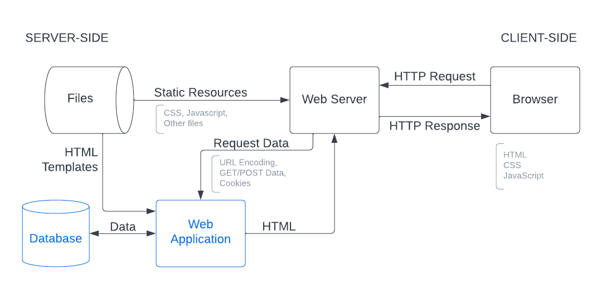

## Client and Server

Computers connected to the web are called clients, servers, or both.

- **Client**: internet connecting devices and web-accessing software on those devices
- **Server**: machines that store information, accessed by clients

### Web Server

Web server can be hardware of software

- Hardware: a computer that stores web server software and a website's component files
- Software: includes several parts that control how web users access hosted files, at minimum an HTTP server

## Web Page Structure

**HTML** - tells your web browser how to structure web pages
**CSS** - tells your browser how to present and style web pages
**JavaScript** - runs locally on your browser to manipulate the elements created in HTML file

### DOM

The Document Object Model (DOM) is a programming API for HTML and XML documents. It treats an XML or HTML document as a tree structure wherein each node is an object representing a part of the document.

## Client-Server Interaction

### HTTP

Web browsers communicates with web servers using the **HyperText Transfer Protocal** (HTTP). When you click a link on a web page, submit a form, or run a search, the browser sends an HTTP Request to the server.

### HTTP Request

HTTP request includes a URL identifying the target server that will process our request. There are multiple types of HTTP request, for example:

- GET
- PUT
- POST
- DELETE

Additional data could be included into the request. Here is an example:

```json
// request line
GET  /index.html  HTTP/1.1

// header
host: localhost:3000
connection: keep-alive
user-agent: Mozilla/5.0
accept-encoding: gzip, deflate, sdch

// body
empty body
```

### HTTP Response

HTTP Response includes a [Status Code](https://developer.mozilla.org/en-US/docs/Web/HTTP/Status). The response, if successful, could include data (eg. the HTML code that the browser will render). Here is an example:

```json
// status line
HTTP/1.1 200 OK

// header
connection: keep-alive
content-type: text/html
date: sun, 21 feb 2016
transfer-encoding: chunked

// body
<html><title>Example HTML File</title></html>
```

## Static v Dynamic Web Server

Static Web Server:

- Returns the same hard-coded content from the server whenever a particular resource is requested.
- Data stored in the server is never modified. Only GET requests are needed. It also doesn't change its responses based on HTTP Request data (eg. URL parameters or cookies)

Dynamic Web Server:

- Can generate and return content based on the specific request URL and data

## Life of a Request in a Dynamic Web Server

1. The Web Browser creates an HTTP GET request to the server using the base URL for the resource (`/product`) and encodes the product name as a URL parameter (`/product?name=cheese`) or as part of the URL pattern (`/product/cheese`).
2. The Web Server detects that the request is dynamic and forwards it to the Web Application for processing.
   (The Web Server determines how to handle different URLs based on pattern matching rules defined in the configuration)
3. The Web Application identifies the intention of the request (get the produt cheese) based on the URL and finds the corresponding thing (cheese). The Web Application then gets the required information from the database.
4. The Web Application dynamically creates an HTML page by putting the data (from the database) into the HTML template.
5. The Web Application returns the generated HTML to the Web Browser (via Web Server), along with a HTTP status code of 200 ("success"). If anything prevents the HTML from being returned then it will send another code (like 404 "does not exist").
6. The Web Browser will then start to process the returned HTML, sending separate requests to get any other CSS or JavaScript files that it references.
7. The Web Browser loads static files from the file system and returns them to the browser directly.



Note that server-side website code does not have to return HTML snippets/files in the response. It can dynamically create and return other types of data (JSON, XML, etc) or file (PDF, CSV, etc).

The idea of returning data to web browser so that it can dynamically update its own content (AJAX - Asynchronous JavaScript and XML) has been around for a while.
